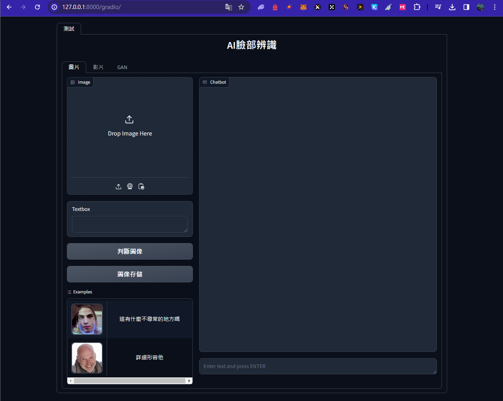

# Hackathon demo
## Goal
- A web demo of face detection, whether an image or video have been edited.
- A Convolution Neural Network model training, and use it in demo page.
- API from chatgpt to describe the Image, or video.
- Deploy on website
- Add Google Analytics
- MySQL store

### Start in web file
install: `pip install -r requirements.txt`
run with `uvicorn web.run:app --reload`

## Deploy on website
1. Go to https://dashboard.render.com/web/new
2. Start command: `uvicorn web.run:app --host 0.0.0.0 --port 5000`
3. Add Python version in additional

## Ref
1. Website: https://www.youtube.com/watch?v=0BEBquff6rI
2. GA4 tag: https://github.com/gradio-app/gradio/issues/5954
3. GA4 note: https://hackmd.io/15X08z7DSz-pSctKHLAn3Q
4. GA4 issue: https://github.com/gradio-app/gradio/issues/6426 (solved: https://github.com/gradio-app/gradio/issues/5954)
5. GAN implementation: https://github.com/bryandlee/animegan2-pytorch/blob/main/demo.ipynb & https://github.com/gradio-app/gradio/blob/2780d067f9f801016c0254de679b56794859abed/demo/animeganv2/run.py#L4

### Website

https://ai-classification.onrender.com/gradio/ (no longer support)

